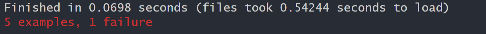

# Volunteer Tracker
#### *Created By: David Couch*

#### **
* * *

## Description
This is an application for learning TDD with ruby while attending Epicodus coding school. This app Might be un finished and does not represent my class mates or my own coding knowledge.

* * *

## Technologies used

* Ruby
* Rspec
* Sinatra
* Capybara
* PostgresSQL

* * *

## Installation :
### Want to see this webpage now?


* Go to ( {http repo} ).
* Navigate to the code button on the github website.

* Click on the code button to open the menu.

- Copy the HTTPS code by clicking the clipboard next to the link.

- Within your Bash terminal navigate to your desired location by using cd followed by your desired directory.
```bash
 cd Desktop
```

- Once you have chosen your desired directory use the command.
```bash
git clone {repo}
```

<div
  style="
    background-color: #d1ecf1;
    color: grey; padding: 6px;
    font-size: 9px;
    border-radius: 5px;
    border: 1px solid #d4ecf1;
    margin-bottom: 12px"
>
  <span
    style="
      font-size: 12px;
      font-weight: 600;
      color: #0c5460;"
  >
    ⓘ
  </span>
  <span
    style="
      font-size: 12px;
      font-weight: 900;
      color: #0c5460;
      margin-bottom: 24px"
  >
    Note :
  </span>
  If you have any problems make sure your HTTPS code is correct! The example above might not be the most recent HTTPS code!
</div>


* Then after the process is completed use the command.

``` bash
code .
```

* Then type

``` bash
gem install bundler

```
* then type

``` bash
bundle install
```
* Then from the terminal you can run logical code through the terminal by typing
```bash
ruby "file goes here (no quotes)"
```

## Testing
* This project was created using **test-driven development** (TDD).

* To view the test suite, open PLACEHOLDER

* To run the test suite yourself and verify program functionality

```bash
rspec
```

* If there is a problem in the code the testing suite will read as such :

<div>
  
</div>

* Follow the examples and read the English that describes what the function should do. If everything is in order you should receive back :
<div>
  
</div>

## Addition comments:
* Created on 8/16/21


* * *

## Contact Information
_David Couch: [Email](dcouch440@gmail.com)_
* * *

## License
> [GPLv3](https://choosealicense.com/licenses/gpl-3.0/)\
> David Couch &copy; 2021
* * *
